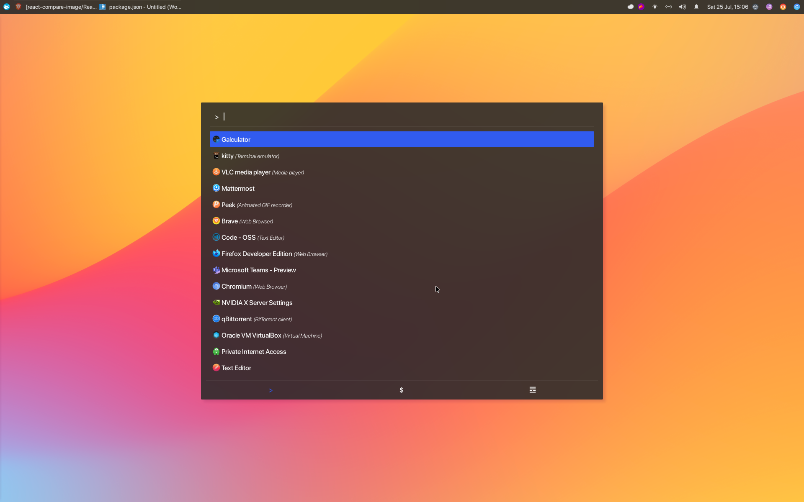
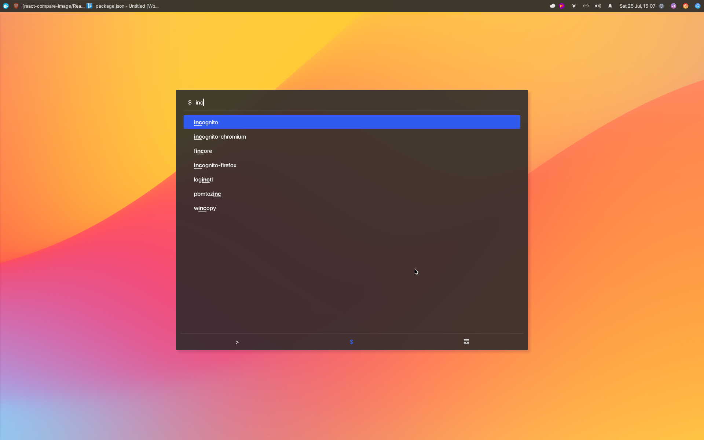
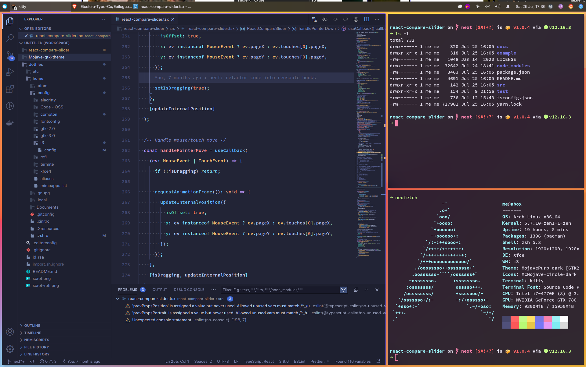

# dotfiles

Dotfiles for Linux and macOS.

Dotfiles for:

-   [Atom](./home/.atom)
-   [Compton](./home/.config/compton)
-   [i3wm (gaps)](./home/.config/i3)
-   [Kitty Terminal](./home/.config/kitty)
-   [Rofi](./home/.local/share/rofi/themes)
-   [Starship](./home/.config/starship)
-   [tmux](./home/.tmux.conf)
-   [VS Code](./home/.config/Code)
-   [zshrc](./home/.zshrc)

## More Scrots

View more screenshots

## Resources

-   [Mojave-gtk-theme](https://github.com/vinceliuice/Mojave-gtk-theme)
-   [Wallpaper](https://dribbble.com/shots/13806303-Wave-Wallpapers)
-   [San-Francisco Pro Fonts](https://github.com/sahibjotsaggu/San-Francisco-Pro-Fonts)
-   [Hasklig Monospace Font](https://github.com/i-tu/Hasklig)
