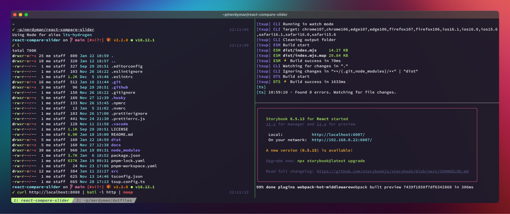

<div align="center">

<h1>dotfiles</h1>

Configs and scripts for macOS and Linux.

[](./home/.config/kitty/)

</div>

## macOS & Linux

- [Git](./home/.gitconfig)
  - [.gitconfig](./home/.gitconfig)
  - [↗ Delta](https://github.com/dandavison/delta)
- [Kitty](./home/.config/kitty)
  - [kitty.conf](./home/.config/kitty/kitty.conf)
  - [↗ Kitty Kitten Search](https://github.com/trygveaa/kitty-kitten-search)
- [Starship](./home/.config/starship)
  - [starship.toml](./home/.config/starship/starship.toml)
- [tmux](./home/.tmux.conf)
- [Visual Studio Code](./home/.config/Code)
  - [keybindings.json](./home/.config/Code/User/keybindings.json)
  - [settings.json](./home/.config/Code/User/settings.json)
- [zsh](./home/.zshrc)
  - [.zshrc](./home/.zshrc)
  - [aliases](./home/.config/aliases)
  - [↗ fnm](https://github.com/Schniz/fnm)
  - [↗ fzf](https://github.com/junegunn/fzf)
  - [↗ grc](https://github.com/garabik/grc)
  - [↗ zsh-syntax-highlighting](https://github.com/zsh-users/zsh-syntax-highlighting)
- [Custom Scripts](./home/.local/bin/)

## macOS

- [Karabiner](./home/.config/karabiner/karabiner.json)
- [macOS mods](./macos-mods.sh)

## Linux

- [Arch Linux Pantheon archinstall](./archinstall/)
- [Gnome mods](./gnome-mods.sh)
- [i3wm (gaps)](./home/.config/i3)

## Install Dependencies

[Homebrew](https://brew.sh/) is used to install dependencies. Run the following to install CLI tools
on Linux and CLI tools and apps on macOS.

### Fonts

- [↗ Hasklig Monospace Font](https://github.com/i-tu/Hasklig)

```sh
bash install-deps.sh
```

## Screenshots

[](./home/.config/Code/User/)

## Other Stuff

- [Gerbera UPnP server Docker config](./home/Documents/configs/gerbera/) for sharing remote folders with my TV
- [💀 Atom](./home/.atom)
