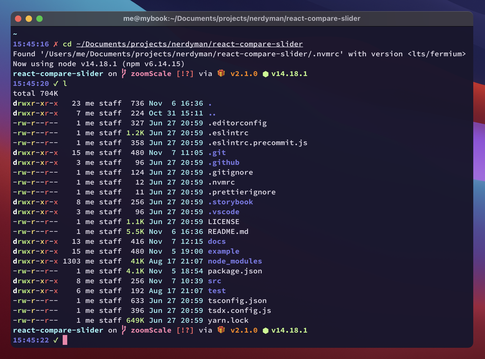
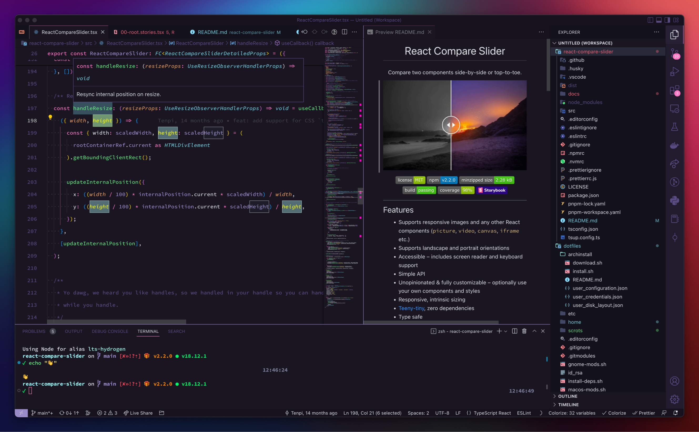

# dotfiles

Dotfiles for Linux and macOS.

[](https://raw.githubusercontent.com/nerdyman/dotfiles/main/scrots/kitty.png)
[](https://raw.githubusercontent.com/nerdyman/dotfiles/main/scrots/vs-code.png)

Configs and scripts for:

- [git](./home/.gitconfig)
- [Gnome mods](./gnome-mods.sh)
- [i3wm (gaps)](./home/.config/i3)
- [Kitty](./home/.config/kitty)
- [Karabiner](./home/.config/karabiner/karabiner.json)
- [macOS tweaks](./home/.bin/macos-tweaks)
- [Starship](./home/.config/starship)
- [tmux](./home/.tmux.conf)
- [Visual Studio Code](./home/.config/Code)
- [zsh](./home/.zshrc)
  - [fnm 🡭](https://github.com/Schniz/fnm)
  - [fzf 🡭](https://github.com/junegunn/fzf)
  - [grc 🡭](https://github.com/garabik/grc)
  - [zsh-syntax-highlighting 🡭](https://github.com/zsh-users/zsh-syntax-highlighting)

## Install Dependencies

[Homebrew](https://brew.sh/) is used to install dependencies. Run the following to install CLI tools
on Linux and CLI tools and apps on macOS.

```sh
bash install-deps.sh
```

## Fonts

- [Hasklig Monospace Font](https://github.com/i-tu/Hasklig)
