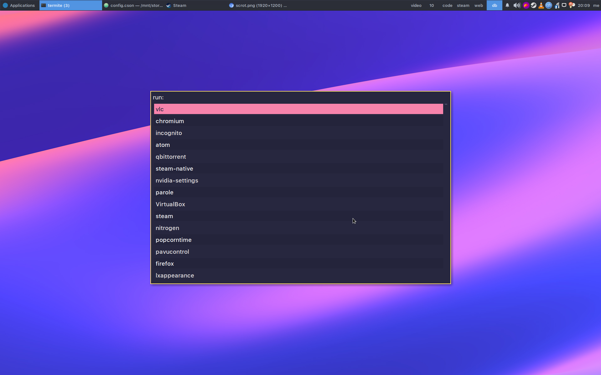

# dotfiles

Dotfiles for:

-   Atom
-   Alacritty
-   Compton
-   i3wm (gaps)
-   GTK 2 & 3
-   Rofi
-   Termite
-   xinitrc
-   Xresources
-   zshrc

## Scrots

## Resources
-   [Adementary Theme](<https://github.com/hrdwrrsk/adementary-theme>)
-   [Wallpaper](<https://dribbble.com/shots/3847300-Accidental-Wallpaper/attachments/871699>)
-   [San-Francisco Pro Fonts](<https://github.com/sahibjotsaggu/San-Francisco-Pro-Fonts>)
-   [Roboto Mono for Powerline](<https://github.com/powerline/fonts/tree/master/RobotoMono>)
