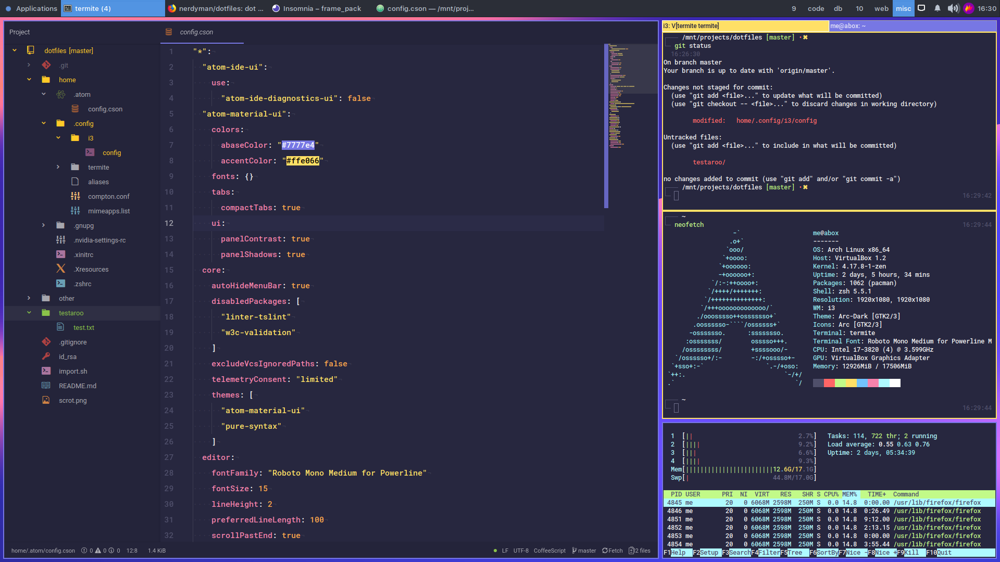

# dotfiles

Dotfiles for:

-   i3wm (gaps)
-   compton
-   gnupg (SSH agent and SSH key timeout)
-   termite
-   xinitrc
-   Xresources
-   zshrc

## Import Script

Gets files listed in `files[]` array and puts them in current directory.

```bash
./import.sh
```

## Scrots


## Resources
-   [Roboto Mono for Powerline](https://github.com/powerline/fonts/tree/master/RobotoMono)
