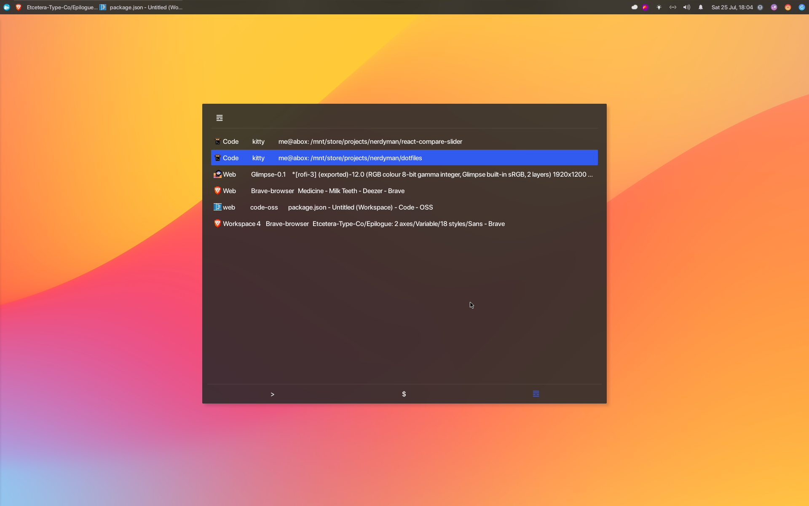

# dotfiles

Dotfiles for:

-   [Atom](./home/.atom)
-   [VSCode](<./home/.config/Code - OSS/User/>)
-   [Kitty Terminal](./home/.config/kitty)
-   [Compton](./home/.config/compton)
-   [i3wm (gaps)](./home/.config/i3)
-   [Rofi](./home/.local/share/rofi/themes)
-   [zshrc](./home/.zshrc)

## More Scrots

Click to expand

## Resources
-   [Adementary Theme](<https://github.com/hrdwrrsk/adementary-theme>)
-   [Wallpaper](<https://dribbble.com/shots/13806303-Wave-Wallpapers>)
-   [San-Francisco Pro Fonts](<https://github.com/sahibjotsaggu/San-Francisco-Pro-Fonts>)
-   [Hasklig Monospace Font](<https://github.com/i-tu/Hasklig>)
