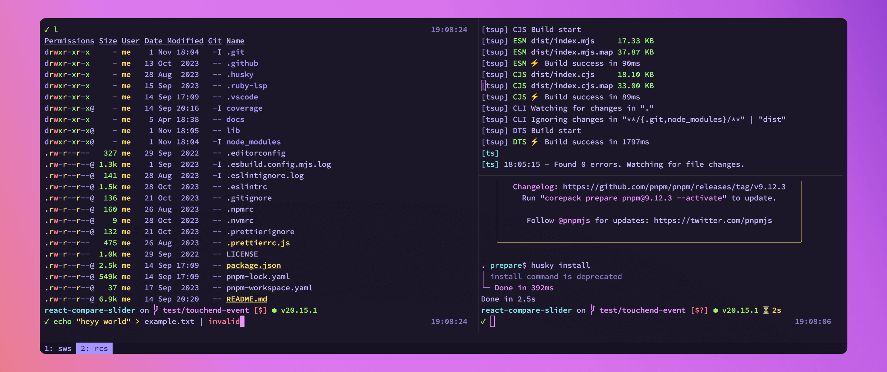

<div align="center">

<h1>dotfiles</h1>

Configs and scripts for macOS and Linux.

[](./home/.config/wezterm/)

</div>

## macOS & Linux

- [Git](./home/.gitconfig)
  - [.gitconfig](./home/.gitconfig)
  - Delta [竊余(https://github.com/dandavison/delta)
- [Kitty](./home/.config/kitty)
  - [kitty.conf](./home/.config/kitty/kitty.conf)
  - [nerdyman kitty theme](./home/.config/kitty/themes/nerdyman.conf)
  - Kitty Kitten Search [竊余(https://github.com/trygveaa/kitty-kitten-search)
- [Starship](./home/.config/starship)
  - [starship.toml](./home/.config/starship/starship.toml)
- [tmux](./home/.tmux.conf)
- [Visual Studio Code](./home/.config/Code)
  - [keybindings.json](./home/.config/Code/User/keybindings.json)
  - [settings.json](./home/.config/Code/User/settings.json)
- [WezTerm](./home/.config/wezterm)
  - [wezterm.lua](./home/.config/wezterm/wezterm.lua)
  - [colors/nerdyman.toml](./home/.config/wezterm/colors/nerdyman.toml) My WezTerm theme
- [Zed](./home/.config/zed)
  - [keymap.json](./home/.config/zed/keymap.json)
  - [settings.json](./home/.config/zed/settings.json)
- [zsh](./home/.zshrc)
  - [.zshrc](./home/.zshrc)
  - [aliases](./home/.config/aliases)
  - fnm [竊余(https://github.com/Schniz/fnm)
  - zsh-syntax-highlighting [竊余(https://github.com/zsh-users/zsh-syntax-highlighting)
- [Custom Scripts](./home/.local/bin/)

## macOS

- [AeroSpace](./home/.config/aerospace/aerospace.toml)
- [Keybindings](./home/Library/KeyBindings)
- [Karabiner](./home/.config/karabiner/karabiner.json)
- [macOS mods](./macos-mods.sh)
- Uses [GNU coreutils竊余(https://formulae.brew.sh/formula/coreutils)
- [Actual working UK keyboard layouts](./Library/Keyboard%20Layouts) (taken from [http://liyang.hu/osx-british.xhtml](http://liyang.hu/osx-british.xhtml))

## Linux

- [Arch Linux Install Scripts](./archinstall/)
- [Gnome mods](./gnome-mods.sh)

## Install Dependencies

[Homebrew](https://brew.sh/) is used to install dependencies. Run the following to install CLI tools
on Linux and CLI tools and apps on macOS.

```sh
bash install-deps.sh
```

### Fonts

- [Hasklig Monospace竊余(https://github.com/i-tu/Hasklig)
- [Mona Sans竊余(https://github.com/github/mona-sans)

## Screenshots

[](./home/.config/Code/User/)

## Other Stuff

- [Gerbera UPnP server Docker config](./home/Documents/configs/gerbera/) for sharing remote folders with my TV
- [💀 Atom](./home/.atom)
- [i3wm (gaps)](./home/.config/i3)
